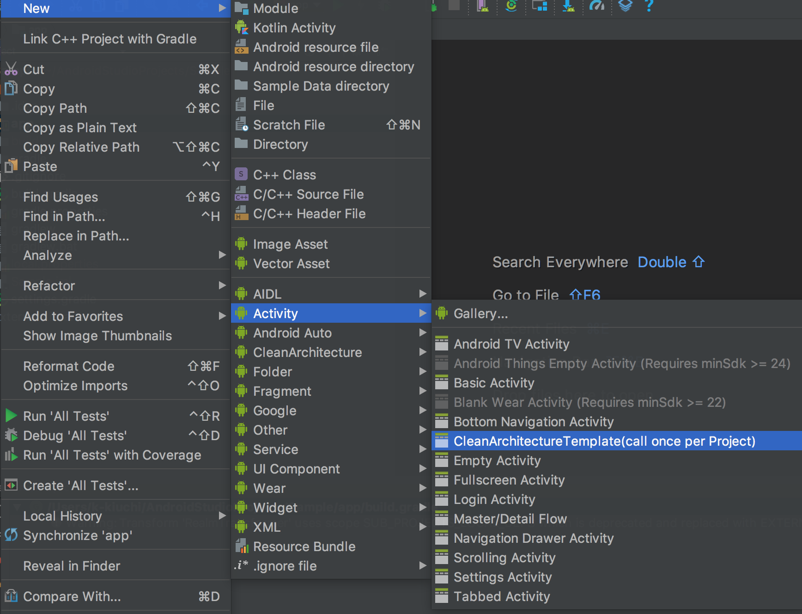
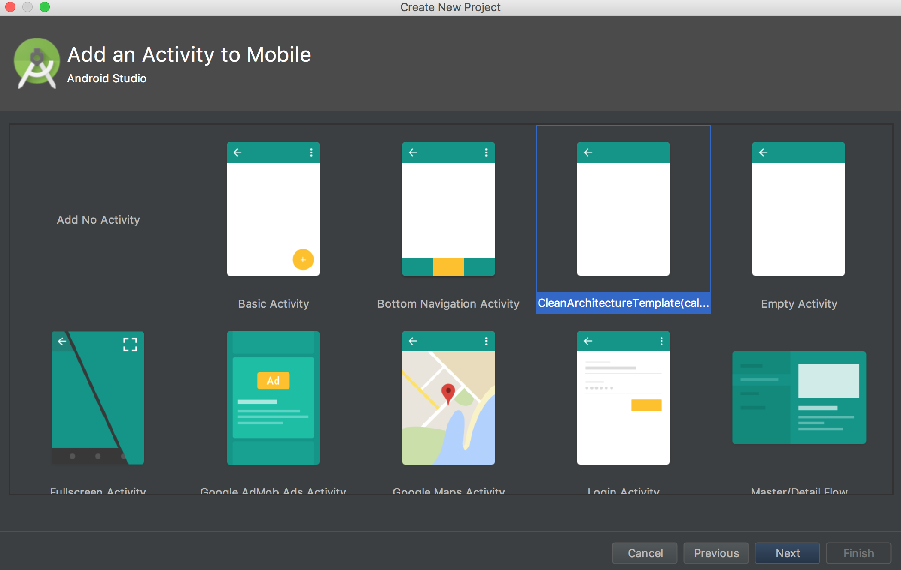
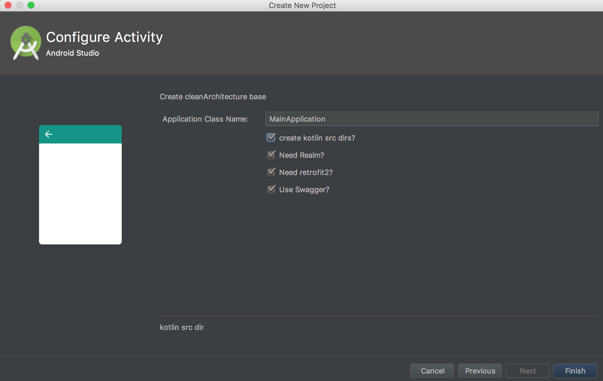
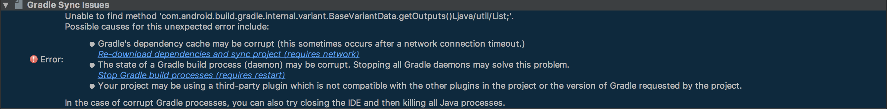
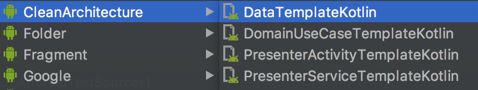
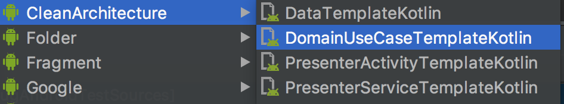
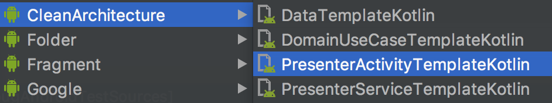
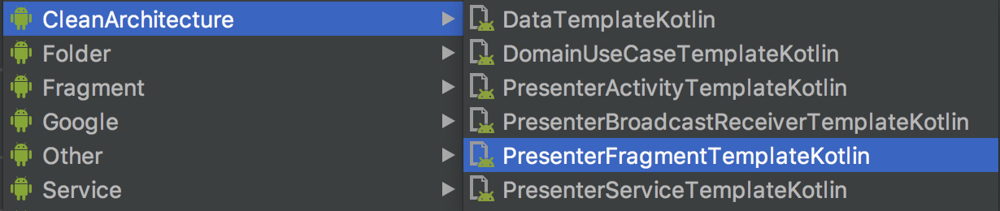
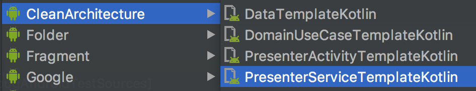
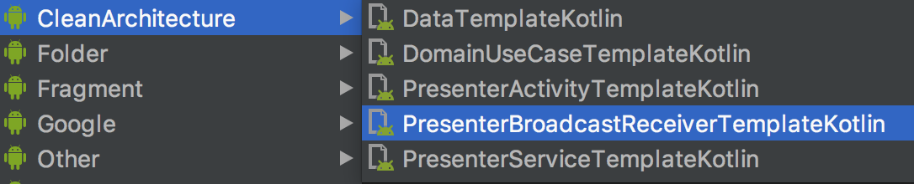

# Android-Studio-CleanArchitecture-template-forKotlin
This is an Android-Studio Template for CleanArchitecture Template & **Kotlin**

This repository is made with reference to  [Android-Studio-MVP-template](https://github.com/benoitletondor/Android-Studio-MVP-template). So, the repository configuration is similar.

It is inspired [Android-CleanArchitecture](https://github.com/android10/Android-CleanArchitecture) and [android-architecture-component](https://github.com/googlesamples/android-architecture-components)

Here's the hierarchy it follows:
```
com.company.app
    +--- data
    |     - datasource
    |     - entity
    |
    +--- domain
    |
    +--- presenter
    |
    +--- utils
    |     +--- annotations
    |     |     - ActivityScope
    |     |     - ViewModelKey
    |     |
    |     +--- commons
    |     |     - BasePresenter
    |     |     - BaseView
    |     |     - DefaultDisposableObserver
    |     |     - ExecutionThreads
    |     |     - InputOnlyUseCase
    |     |     - IoUseCase
    |     |     - OutputOnlyUseCase
    |     |     - SimpleUseCase
    |     |     - UseCase
    |     +--- di
    |     |     - ApiModules
    |     |     - ApplicationModule
    |     |     - BindingModules
    |     |     - Injectable
    |     |     - RepositoryModules
    |     |     - RootComponent
    |     |     - ViewModelFactory
    |     |
    |     +--- exceptions
    |     |
    |     +--- extensions
    |           - Observable
    |
    | - MainApplication

res
 +--- layout
 |    - base_activity.xml
```

## Prerequisites
You must satisfy the following conditions.

- [Kotlin](https://kotlinlang.org/)**(Recommended to use [Android-Studio 3.X](https://developer.android.com/studio/preview/index.html))**
- [Dagger2](https://google.github.io/dagger/) for dependency injection
- [RxJava2](https://github.com/ReactiveX/RxJava) for Asynchronous processing.
- [Kotlin Android Extensions](https://kotlinlang.org/docs/tutorials/android-plugin.html) (Default Support)

# Support Main Libraries, Service, Layout,
- [Dagger2](https://google.github.io/dagger/)
- [RxJava2](https://github.com/ReactiveX/RxJava)
- [Realm](https://realm.io/)
- [ConstraintLayout](https://developer.android.com/reference/android/support/constraint/ConstraintLayout.html)
- [Retrofit2](http://square.github.io/retrofit/)
- [Swagger](https://swagger.io/)
- ~~[android-ktx](https://github.com/android/android-ktx)~~(Temporary unsupported, Because conflict with AndroidX Libs)
- [DataBinding](https://developer.android.com/topic/libraries/data-binding/index.html)
- [ViewModel](https://developer.android.com/topic/libraries/architecture/viewmodel.html)
- [Spek1.X](http://spekframework.org/docs/latest/)
- [Mockito](http://site.mockito.org/)
- [robolectric](http://robolectric.org/)
- [Assert-J](http://joel-costigliola.github.io/assertj/)

## Installation

#### For Mac:

- If you have a standard Android Studio installation:

Just run the install script at the root of this repository:

```
./install.sh
```

- Manual installation:

Just copy all 5 directories
- `BaseCleanArchitectureTemplateKotlin`
- `DataTemplateKotlin`
- `DomainTemplateKotlin`
- `PresenterActivityTemplateKotlin`
- `PresenterFragmentTemplateKotlin`
- `PresenterServiceTemplateKotlin`
- `PresenterBroadcastReceiverTemplateKotlin`

and paste to `$ANDROID_STUDIO_FOLDER$/Contents/plugins/android/lib/templates/activities/`

#### For Windows:

Just copy all 5 directories
- `BaseCleanArchitectureTemplateKotlin`
- `DataTemplateKotlin`
- `DomainTemplateKotlin`
- `PresenterActivityTemplateKotlin`
- `PresenterFragmentTemplateKotlin`
- `PresenterServiceTemplateKotlin`
- `PresenterBroadcastReceiverTemplateKotlin`

and paste to  `$ANDROID_STUDIO_FOLDER$\plugins\android\lib\templates\activities\`

## How to Use
#### 1. Generate Base template
First of all, create the base hierarchy and classes using `CleanArchitectureTemplate` from the **root package folder**. This needs to be done only once per project:


Or if you create a new project, please select `CleanArchitectureTemplate` on this screen


Next, you set project config.
- **Application Class Name** -> Set Root ApplicationClass Name
- **Create kotlin src dir?** -> Please check if you have not previously created the kotlin folder
- **Need Realm?** -> Please check this when using [Realm](https://realm.io/)
- **Need Retrofit2?** -> Please check this when using  [Retrofit2](http://square.github.io/retrofit/)
- **Use Swagger?** -> Please check this if the Retrofit API was created by [Swagger](http://swagger.io/)(RxJava2 used)



When all settings are completed click the Finish button!!

#### 2. Fix build.gradle
If you get folloing error, fix root/build.gradle.


```
buildscript {
-    ext.kotlin_version = '1.1.2-3'
+    ext.kotlin_version = '1.1.2-4'
    repositories {
        maven { url 'https://maven.google.com' }
        jcenter()
    }
```

By the way, this error has already been discussed in [Stack Over Flow](https://stackoverflow.com/questions/44042754/android-studio-3-0-unable-to-find-method-com-android-build-gradle-internal-va)


**Some time, app/build.gradle file will also be broken...(WANTED  Info)**.
So, **Some settings are commented out**.
for that reason, **MUST FIX these FIXME!!**

*1st FIXME* Uncomment out
```
release {
    minifyEnabled true
    proguardFiles getDefaultProguardFile('proguard-android.txt'), 'proguard-rules.pro'
    debuggable false
    zipAlignEnabled true
    shrinkResources true
    //          FIXME comment out this!!
    //          proguardFiles {
    //              getDefaultProguardFile('proguard-android.txt')
    //              "proguard-rules.pro"
    //          }
    //          def files = rootProject.file("proguard")
    //                  .listFiles()
    //                  .findAll { it.name.startsWith("proguard") }
    //                  .toList()
    //                  .toArray()
    //          proguardFiles(files)
}
```
*2nd FIXME* Uncomment out and move to Top this Code
```
........
kapt 'com.google.dagger:dagger-compiler:2.+'
kapt 'com.google.dagger:dagger-android-processor:2.+'
}

// FIXME comment out this!! and move to file top!!

// apply plugin: 'realm-android'

// FIXME comment out this!! and move to file top!!

// apply plugin: 'kotlin-kapt'
```

Paste top of build.gradle

```
apply plugin: 'com.android.application'
apply plugin: 'kotlin-android'
apply plugin: 'kotlin-android-extensions'
+ apply plugin: 'realm-android'
+ apply plugin: 'kotlin-kapt'
android {
```

*3rd FIXME* add dependencies
```
dependencies {
  ...
    androidTestImplementation 'com.android.support.test.espresso:espresso-contrib:3.0.2', {
      exclude group: 'com.android.support'
    }
}
```

*4th FIXME* replace version to SAME support Library Version
```
configurations.all {
    //FIXME replace version to SAME support Library Version!!

    resolutionStrategy.force "com.android.support:support-annotations:28.+"
}
```

### Use CleanArchitecture Template
Some templates need your work.

#### DataTemplateKotlin
This template create data-layer template.


This template will add DataSourceClass and DataRepositoryClass.

And then, please see DataSourceClass.The following notice is written there.
```
/*    FIXME MUST add below method to RepositoryModules */
//    @Binds abstract fun bindSomeDataSource(repository: SomeRepository):SomeDataSource
```

So, Copy `@Binds abstract fun bindSomeDataSource(repository: SomeRepository):SomeDataSource` to `RepositoryModules`


This Layer Provide Interface to domain.


#### DomainTemplateKotlin
This template create domain-layer template.


This template will add IoUsecaseClass or InputOnlyUseCaseClass or OutputOnlyUseCaseClass or SimpleUseCaseClass.

This Layer Provide Bussiness Logic and connect DataLayer to PresentationLayer.


#### PresenterActivityTemplateKotlin
This template create presenter-layer template.


This template will add ContractClass, ModuleClass, PresenterViewModelClass, ActivityClass, FragmentClass and fragment.xml.

And then, please see ModuleClass. The following notice is written there.
```
/* FIXME MUST add below method to BindingModules */
// @ContributesAndroidInjector(modules = [SomeModule::class]) @ActivityScope abstract fun contributeSomeActivityInjector(): SomeActivity
```

So, Copy `@ContributesAndroidInjector(modules = [SomeModule::class]) @ActivityScope abstract fun contributeSomeActivityInjector(): SomeActivity` to `BindingModules`.

This Layer Provides UserInterface(Activity & Fragment).
And presenterClass communicate domain-layer.

#### PresenterFragmentTemplateKotlin
This template create presenter-layer template.


This template will add ContractClass, PresenterViewModelClass, FragmentClass and fragment.xml.

And then, please see FragmentClass. The following notice is written there.
```
/* FIXME MUST add below method to Parent Activity's Module */
//    @Binds @IntoMap @ViewModelKey(SomePresenterViewModel::class) abstract fun bindSomePresenterViewModel(viewModel: SomePresenterViewModel): ViewModel
//    @ContributesAndroidInjector abstract fun contributeSomeFragment():SomeFragment
```

So, Copy `@Binds @IntoMap @ViewModelKey(SomePresenterViewModel::class) abstract fun bindSomePresenterViewModel(viewModel: SomePresenterViewModel): ViewModel` and `@ContributesAndroidInjector abstract fun contributeSomeFragment():SomeFragment` to `Parent activity's module`.

This Layer Provides UserInterface(Fragment).
And presenterClass communicate domain-layer.

#### PresenterServiceTemplateKotlin
This template create presenter-layer template.


This template will add ContractClass, ModuleClass, PresenterClass and ServiceClass.

And then, please see ModuleClass. The following notice is written there.
```
/* FIXME MUST add below method to BindingModules */
// @ContributesAndroidInjector(modules = [SomeServiceModule::class]) abstract fun contributeSomeServiceServiceInjector(): SomeServiceService
```

So, Copy `@ContributesAndroidInjector(modules = [SomeServiceModule::class]) abstract fun contributeSomeServiceServiceInjector(): SomeServiceService` to `BindingModules`.

This Layer Provides UserInterface(Service).
And presenterClass communicate domain-layer.

#### PresenterBroadCastReceiverTemplateKotlin
This template create presenter-layer template.


This template will add ContractClass, ModuleClass, PresenterClass and ReceiverClass.

And then, please see ModuleClass. The following notice is written there.
```
/* FIXME MUST add below method to BindingModules */
// @ContributesAndroidInjector(modules = [SomeReceiverModule::class]) abstract fun contributeSomeReceiverReceiverInjector(): SomeReceiverReceiver
```

So, Copy `@ContributesAndroidInjector(modules = [SomeReceiverModule::class]) abstract fun contributeSomeReceiverReceiverInjector(): SomeReceiverReceiver` to `BindingModules`.


This Layer Provides UserInterface(BroadCastReceiver).
And presenterClass communicate domain-layer.

## Example
Very simple example is in the Example folder.

## 日本語の説明
Qiitaに以下の記事を公開したのでそちらを参照

「[Kotlin用のCleanArchitectureのテンプレート作ったよ！](http://qiita.com/k_keisuke/items/38bf26e711b6918703b8)」

# Reference URL
- https://github.com/benoitletondor/Android-Studio-MVP-template
- https://github.com/android10/Android-CleanArchitecture
- https://github.com/googlesamples/android-architecture-components
- http://y-anz-m.blogspot.jp/2018/04/reified-lazy-intent-extra.html

# Licence
```
Copyright 2017- kiuchi keisuke

Licensed under the Apache License, Version 2.0 (the "License");
you may not use this file except in compliance with the License.
You may obtain a copy of the License at

   http://www.apache.org/licenses/LICENSE-2.0

Unless required by applicable law or agreed to in writing, software
distributed under the License is distributed on an "AS IS" BASIS,
WITHOUT WARRANTIES OR CONDITIONS OF ANY KIND, either express or implied.
See the License for the specific language governing permissions and
limitations under the License.
```
